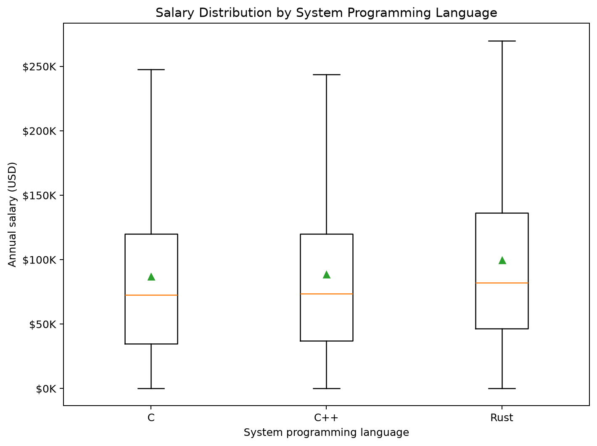

# 시스템 프로그래밍 언어 분석

## 1. 분석 목적

C, C++, Rust 사용자의 연봉·경력·직무 특성을 비교한다.

## 2. 대상 언어

- C, C++, Rust
- 도메인 표본: 7,362명

## 3. 데이터 전처리

- 공통 정제 데이터 `data/results.csv` 사용
- 정확한 언어 0/1 플래그로 사용자 선택
- 연봉과 경력은 숫자형으로 변환하고 유효값 기준으로 집계

## 4. 기술통계

| 언어 | 사용자 수 | 평균 연봉 | 중앙 연봉 | 표준편차 | Q1 | Q3 | 평균 경력 | 주요 직무 |
|---|---:|---:|---:|---:|---:|---:|---:|---|
| C | 3,972 | $87,061 | $72,496 | $72,173 | $34,804 | $120,000 | 14.0년 | Developer, full-stack |
| C++ | 4,480 | $88,745 | $73,516 | $72,938 | $37,094 | $120,000 | 13.7년 | Developer, full-stack |
| Rust | 3,031 | $99,774 | $82,000 | $76,318 | $46,406 | $136,141 | 11.9년 | Developer, full-stack |

## 5. 시각화 결과

## 6. 통계 검정

- 검정: 양측 Welch 독립표본 t-test
- C++ 전용군: n=3,367, 평균=$85,769
- Rust 전용군: n=1,918, 평균=$100,951
- t-statistic: -7.3050
- p-value: 0.000000
- 해석: 5% 유의수준에서 C++ 전용군과 Rust 전용군의 평균 연봉 차이는 통계적으로 유의하다.

## 7. 결과 해석

1. 시스템 언어별 연봉은 중앙값과 사분위 범위까지 함께 비교해야 한다.
2. Rust와 C++ 비교에서는 두 언어를 동시에 사용하는 응답자를 제외했다.
3. 직무·경력 구성 차이를 함께 확인해야 언어별 연봉 차이를 과대해석하지 않을 수 있다.

## 8. 분석 한계

- 언어별 그룹은 기술통계에서 서로 중복될 수 있다.
- 관찰 자료이므로 언어 사용과 연봉 사이의 인과관계를 의미하지 않는다.
