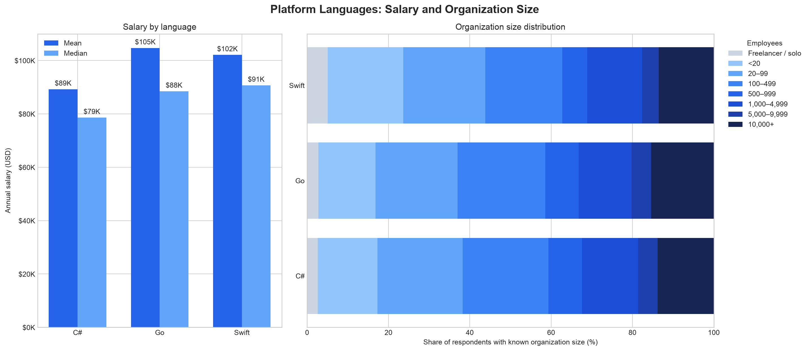

# 플랫폼·백엔드 언어 분석

## 1. 분석 목적

C#, Go, Swift 사용자의 연봉과 조직 규모, 근무 형태, 경력 분포가 어떻게 다른지 분석한다.

## 2. 대상 언어

- C#, Go, Swift

## 3. 데이터 전처리

- 입력: `data/results.csv`
- 공통 정제 CSV만 사용하며 언어별 0/1 플래그로 사용자를 선택
- 연봉 단위: 연간 USD (`ConvertedCompYearly`)
- 언어별 집계: 복수 언어 사용자는 각 언어 그룹에 중복 포함
- 비율: 해당 문항의 결측·미지 응답을 제외한 유효 응답 기준

## 4. 기술통계

| Language | N | Mean | Median | Std | Q1 | Q3 |
| --- | --- | --- | --- | --- | --- | --- |
| C# | 6,309 | $89,260 | $78,633 | $63,073 | $45,509 | $120,471 |
| Go | 3,679 | $104,710 | $88,494 | $78,364 | $48,000 | $145,917 |
| Swift | 1,156 | $102,127 | $90,723 | $73,749 | $50,000 | $140,000 |

### 조직 규모 비교

셀프 고용을 별도 구간으로 두었고, 결측과 `I don’t know`는 비율 모수에서 제외했다.

| Language | Valid N | Freelancer / solo | <20 | 20–99 | 100–499 | 500–999 | 1,000–4,999 | 5,000–9,999 | 10,000+ |
| --- | --- | --- | --- | --- | --- | --- | --- | --- | --- |
| C# | 5,607 | 2.6 | 14.7 | 21.0 | 21.1 | 8.3 | 13.8 | 4.8 | 13.8 |
| Go | 3,292 | 2.8 | 14.0 | 20.2 | 21.6 | 8.2 | 13.0 | 4.8 | 15.4 |
| Swift | 974 | 5.0 | 18.6 | 20.2 | 18.9 | 6.2 | 13.4 | 4.1 | 13.6 |

### 원격·하이브리드·대면 근무 비율

설문의 두 가지 Hybrid 선택지와 `Your choice` 선택지를 `Hybrid / flexible`로 통합했다.

| Language | Valid N | Remote (%) | Hybrid / flexible (%) | In-person (%) |
| --- | --- | --- | --- | --- |
| C# | 5,662 | 30.9 | 53.7 | 15.4 |
| Go | 3,317 | 38.6 | 50.1 | 11.3 |
| Swift | 987 | 38.5 | 49.4 | 12.1 |

### 경력 분포

전문 경력(`YearsCodePro`)을 6개 구간으로 나눈 비율이다.

| Language | Valid N | 0–2 years | 3–5 years | 6–10 years | 11–15 years | 16–20 years | 21+ years |
| --- | --- | --- | --- | --- | --- | --- | --- |
| C# | 6,219 | 7.7 | 14.1 | 21.5 | 17.1 | 13.3 | 26.3 |
| Go | 3,630 | 7.7 | 16.2 | 25.7 | 18.1 | 12.9 | 19.3 |
| Swift | 1,136 | 6.1 | 13.0 | 24.5 | 21.7 | 12.1 | 22.6 |

## 5. 시각화 결과

## 6. 통계 검정

독립 표본 가정을 위해 C#과 Go를 동시에 사용한 응답자는 검정에서 제외했다. 등분산을 가정하지 않는 양측 Welch t-test를 적용했다.

- C# 전용군: n=5,453, 평균 $87,776
- Go 전용군: n=2,823, 평균 $106,529
- 평균 차이(C# - Go): $-18,753
- 95% 신뢰구간: [$-22,129, $-15,376]
- t(4581.5) = -10.887, p = 2.855e-27
- 결론: 5% 유의수준에서 두 그룹의 평균 연봉 차이는 통계적으로 유의하다.

## 7. 결과 해석

1. 세 언어의 연봉은 평균뿐 아니라 중앙값·표준편차·사분위 범위를 함께 봐야 한다.
2. 언어별 원격근무 비율과 조직 규모 구성에 차이가 있어 연봉 결과와 함께 해석해야 한다.
3. C#과 Go를 동시에 쓰는 응답자를 검정에서 제외해 독립표본 조건을 보완했다.

## 8. 분석 한계

- 이 분석은 관찰 데이터의 기술통계이며, 언어 사용이 연봉 차이의 원인임을 의미하지 않는다.
- 국가, 직무, 경력, 조직 규모 등의 교란 요인을 별도로 통제하지 않았다.
