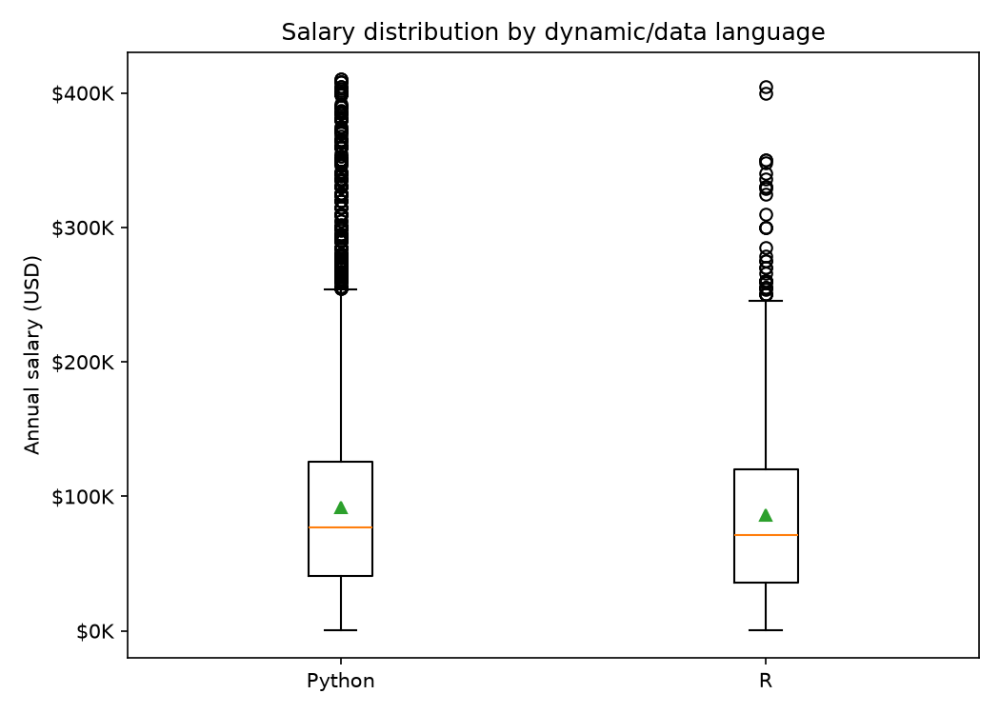
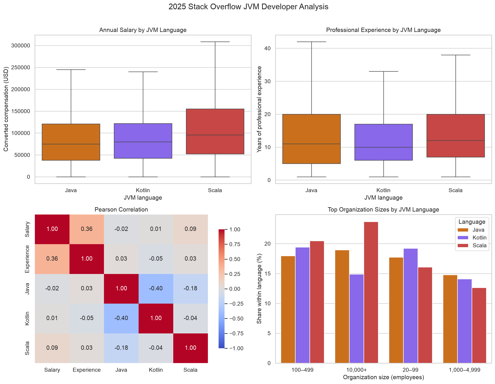

# Stack Overflow 개발자 연봉 분석 및 고연봉 예측

> 이 문서는 여섯 개 독립 도메인의 분석 결과를 자동으로 통합한 최종 보고서입니다.

## Executive Summary

- 데이터: Stack Overflow Developer Survey 2025
- 공통 정제 표본: 21,678명
- 분석 언어: 14개
- 표본 기준 미달 언어: Julia
- 전체 연봉 중앙값: $75,744
- 최종 ML: Accuracy 0.810, F1 0.810, ROC-AUC 0.890

## 1. 데이터 준비 및 EDA

공통 전처리 스크립트가 연봉·언어 결측, 0 이하 연봉, 중복 ResponseId, 상·하위 1% 연봉 이상치를 처리한다. 전문 경력은 숫자로 변환하고 언어는 세미콜론 토큰으로 정확히 분리한다.

- 원본 행 수: 49,191
- 필수값 처리 후: 22,121
- 최종 행 수: 21,678
- 공통 정제 데이터의 중복 ResponseId: 0건
- 연봉 이상치 범위: $93 - $413,200

### Pandas·Polars 결과 비교

| 라이브러리 | 행 | 열 | 로딩 시간(초) | 평균 연봉 | 중앙 연봉 | 컬럼 일치 | 요약값 일치 |
|---|---:|---:|---:|---:|---:|---|---|
| Pandas | 21,678 | 27 | 0.0285 | $89,448 | $75,744 | True | True |
| Polars | 21,678 | 27 | 0.0189 | $89,448 | $75,744 | True | True |

## 2. 시각화

- Seaborn 정적 차트: [JVM 언어 종합 차트](domain2_jvm/result/salary_chart.png)
- Plotly 인터랙티브 차트: [웹 언어 인터랙티브 분석](domain3_web/salary_interactive.html)
- Plotly 통합 보고서: [전체 언어 연봉 분석](domain6_ml/language_salary_report.html)

모든 주요 차트에는 제목과 축 레이블을 포함했다.

## 3. 통계 분석

각 도메인은 평균·표준편차·사분위수를 산출하고, Domain 2는 Pearson 상관계수를 표와 히트맵으로 출력한다. 언어 간 평균 연봉 비교에는 `scipy.stats.ttest_ind` 기반 양측 Welch t-test를 사용하며 동시 사용자는 비교 표본에서 제외한다.

## 4. ML Pipeline

- 목표: 학습 데이터 연봉 중앙값($76,340) 이상 여부
- 전처리: 수치형 중앙값 대치·표준화, 범주형 최빈값 대치·One-Hot Encoding
- 모델: LogisticRegression(class_weight='balanced')
- Accuracy: 0.810
- Precision: 0.800
- Recall: 0.821
- F1-score: 0.810
- ROC-AUC: 0.890
- 저장 모델: [high_salary_model.joblib](domain6_ml/high_salary_model.joblib)
- 혼동행렬: [confusion_matrix.png](domain6_ml/confusion_matrix.png)

## 5. 도메인별 결과

### Domain 1 - 동적·데이터 언어

## 1. 분석 목적

Python, R, Julia 사용자의 연봉·경력·직무 특성을 비교하고 Python과 R 전용 사용자의 평균 연봉 차이를 검정한다.

## 2. 대상 언어

- 분석 언어: Python, R
- 최소 표본 기준 미달: Julia

## 3. 데이터 전처리

- 공통 정제 데이터 `data/results.csv` 사용
- 연봉·언어 결측과 0 이하 연봉 제거, 상·하위 1% 이상치 제거
- 언어 문자열을 세미콜론 기준으로 분리한 0/1 플래그 사용
- 전체 도메인 표본: 12,591명

## 4. 기술통계

| 언어 | 사용자 수 | 평균 연봉 | 중앙 연봉 | 표준편차 | Q1 | Q3 | 평균 경력 | 주요 직무 |
|---|---:|---:|---:|---:|---:|---:|---:|---|
| Python | 12,457 | $92,075 | $76,570 | $72,043 | $40,605 | $126,000 | 13.1년 | Developer, full-stack |
| R | 984 | $86,430 | $71,328 | $69,283 | $35,965 | $120,000 | 13.8년 | Developer, full-stack |

## 5. 시각화 결과

## 6. 통계 검정

- 검정: 양측 Welch 독립표본 t-test
- Python 전용군: n=11,607
- R 전용군: n=134
- t-statistic: 0.7428
- p-value: 0.458893
- 해석: 5% 유의수준에서 Python 전용군과 R 전용군의 평균 연봉 차이는 통계적으로 유의하지 않다.

## 7. 결과 해석

1. 평균과 중앙값을 함께 보면 언어별 연봉 수준과 분포의 비대칭성을 구분할 수 있다.
2. 표본 수가 크게 다른 언어 비교에는 평균만이 아니라 중앙값과 사분위 범위를 함께 사용해야 한다.
3. t-test는 두 언어를 동시에 사용하는 응답자를 제외해 독립 표본에 가깝게 구성했다.

## 8. 분석 한계

- 복수 언어 사용자와 국가·직무·경력 차이가 관찰된 연봉 차이에 함께 반영될 수 있다.
- 설문 관찰 자료이므로 특정 언어 사용이 높은 연봉의 원인이라고 해석할 수 없다.

### Domain 2 - JVM·엔터프라이즈 언어

## 1. 분석 목적

Java, Kotlin, Scala 사용자의 연봉·경력·직무·조직 규모를 비교한다.

## 2. 대상 언어

- Java, Kotlin, Scala
- JVM 도메인 표본: 7,065명

## 3. 데이터 전처리

- 공통 정제 데이터 `data/results.csv` 사용
- Pandas와 Polars로 동일 CSV를 로딩해 크기·컬럼·연봉 요약값·중복 결과 비교
- 세 라이브러리 플래그는 정확한 세미콜론 토큰 분리 결과를 사용

| 라이브러리 | 행 | 열 | 로딩 시간(초) | 평균 연봉 | 중앙 연봉 | 중복 ID |
|---|---:|---:|---:|---:|---:|---:|
| Pandas | 21,678 | 27 | 0.0285 | $89,448 | $75,744 | 0 |
| Polars | 21,678 | 27 | 0.0189 | $89,448 | $75,744 | 0 |

## 4. 기술통계

| 언어 | 사용자 수 | 평균 연봉 | 중앙 연봉 | 표준편차 | Q1 | Q3 | 평균 경력 |
|---|---:|---:|---:|---:|---:|---:|---:|
| Java | 6,134 | $89,331 | $75,000 | $71,832 | $37,999 | $121,000 | 13.4년 |
| Kotlin | 2,355 | $91,382 | $80,000 | $70,084 | $42,286 | $121,815 | 12.7년 |
| Scala | 570 | $112,505 | $95,674 | $81,577 | $52,232 | $155,000 | 14.2년 |

### Pearson 상관계수

| 변수 | 연봉 | 경력 | Java | Kotlin | Scala |
|---|---:|---:|---:|---:|---:|
| 연봉 | 1.000 | 0.362 | -0.021 | 0.014 | 0.094 |
| 경력 | 0.362 | 1.000 | 0.030 | -0.045 | 0.026 |
| Java | -0.021 | 0.030 | 1.000 | -0.399 | -0.180 |
| Kotlin | 0.014 | -0.045 | -0.399 | 1.000 | -0.036 |
| Scala | 0.094 | 0.026 | -0.180 | -0.036 | 1.000 |

## 5. 시각화 결과

## 6. 통계 검정

- 검정: 양측 Welch 독립표본 t-test
- Java 전용군: n=4,539
- Kotlin 전용군: n=760
- t-statistic: -0.3164
- p-value: 0.751722
- 해석: 5% 유의수준에서 Java 전용군과 Kotlin 전용군의 평균 연봉 차이는 통계적으로 유의하지 않다.

## 7. 결과 해석

1. JVM 언어별 연봉은 평균·중앙값·사분위 범위를 함께 비교해야 한다.
2. 연봉과 전문 경력의 Pearson 상관계수는 차트와 표에서 동시에 확인할 수 있다.
3. Pandas와 Polars는 동일한 데이터 크기와 핵심 연봉 요약값을 산출했다.

## 8. 분석 한계

- 복수 언어 사용자는 언어별 기술통계에 중복 포함될 수 있다.
- 국가·직무·경력 등 교란 요인을 통제하지 않은 관찰 분석이므로 인과관계로 해석할 수 없다.

### Domain 3 - 웹 개발 언어

## 1. 분석 목적
웹 개발 언어(JavaScript, TypeScript, PHP) 사용자의 연봉 수준, 경력 분포, 직무 특성 비교

## 2. 대상 언어
- JavaScript, TypeScript, PHP

## 3. 데이터 전처리
- 공통 정제 데이터 `data/results.csv` 사용
- 세미콜론으로 정확히 분리된 언어 0/1 플래그 사용
- 경력은 숫자형으로 변환하고 직무는 프론트엔드·백엔드·풀스택·기타로 분류
- 총 표본: 16,093명
- JavaScript: 14,606명
- TypeScript: 10,151명
- PHP: 4,010명

## 4. 기술통계

| 언어 | 표본수 | 평균연봉 | 중앙값 | 표준편차 | Q1 | Q3 |
|------|--------|---------|--------|----------|----|----|
| JavaScript | 14,606 | $88,058 | $75,410 | $67,436 | $40,000 | $120,000 |
| TypeScript | 10,151 | $91,521 | $79,315 | $68,420 | $43,664 | $125,000 |
| PHP | 4,010 | $71,217 | $60,155 | $58,029 | $28,424 | $98,612 |

### 직무 구성

| 언어 | 직무 | 인원 | 비율 |
|---|---|---:|---:|
| JavaScript | 프론트엔드 | 960 | 6.6% |
| JavaScript | 백엔드 | 2,064 | 14.1% |
| JavaScript | 풀스택 | 5,988 | 41.0% |
| JavaScript | 기타·미응답 | 5,594 | 38.3% |
| TypeScript | 프론트엔드 | 841 | 8.3% |
| TypeScript | 백엔드 | 1,383 | 13.6% |
| TypeScript | 풀스택 | 4,564 | 45.0% |
| TypeScript | 기타·미응답 | 3,363 | 33.1% |
| PHP | 프론트엔드 | 178 | 4.4% |
| PHP | 백엔드 | 544 | 13.6% |
| PHP | 풀스택 | 1,828 | 45.6% |
| PHP | 기타·미응답 | 1,460 | 36.4% |

## 5. 시각화 결과

- 정적 차트: [salary_comparison.png](domain3_web/salary_comparison.png)
- 인터랙티브 차트: [salary_interactive.html](domain3_web/salary_interactive.html)

## 6. 통계 검정

- 검정: JavaScript 전용군과 TypeScript 전용군의 양측 Welch t-test
- JavaScript 전용군: n=5,633, 평균 $83,888
- TypeScript 전용군: n=1,178, 평균 $97,951
- t-statistic: -6.2760
- p-value: 4.43931e-10
- 해석: 5% 유의수준에서 평균 연봉 차이는 통계적으로 유의하다.

## 7. 결과 해석

1. 웹 언어별 연봉은 평균·중앙값·사분위 범위를 함께 비교해야 한다.

2. 경력 구간별 중앙 연봉 차트로 경력 구성 차이가 언어별 연봉 차이에 미치는 영향을 확인할 수 있다.

3. 직무 비율과 복수 언어 사용을 함께 고려해야 단순한 언어 효과로 과대해석하지 않을 수 있다.

## 8. 분석 한계

- Stack Overflow 설문은 온라인 커뮤니티 기반 표본이므로 모집단 대표성에 한계가 있다.
- 대부분의 개발자가 여러 언어를 함께 사용하므로 한 언어의 순수한 인과 효과를 분리하기 어렵다.

### Domain 4 - 시스템 프로그래밍 언어

## 1. 분석 목적

C, C++, Rust 사용자의 연봉·경력·직무 특성을 비교한다.

## 2. 대상 언어

- C, C++, Rust
- 도메인 표본: 7,362명

## 3. 데이터 전처리

- 공통 정제 데이터 `data/results.csv` 사용
- 정확한 언어 0/1 플래그로 사용자 선택
- 연봉과 경력은 숫자형으로 변환하고 유효값 기준으로 집계

## 4. 기술통계

| 언어 | 사용자 수 | 평균 연봉 | 중앙 연봉 | 표준편차 | Q1 | Q3 | 평균 경력 | 주요 직무 |
|---|---:|---:|---:|---:|---:|---:|---:|---|
| C | 3,972 | $87,061 | $72,496 | $72,173 | $34,804 | $120,000 | 14.0년 | Developer, full-stack |
| C++ | 4,480 | $88,745 | $73,516 | $72,938 | $37,094 | $120,000 | 13.7년 | Developer, full-stack |
| Rust | 3,031 | $99,774 | $82,000 | $76,318 | $46,406 | $136,141 | 11.9년 | Developer, full-stack |

## 5. 시각화 결과

## 6. 통계 검정

- 검정: 양측 Welch 독립표본 t-test
- C++ 전용군: n=3,367, 평균=$85,769
- Rust 전용군: n=1,918, 평균=$100,951
- t-statistic: -7.3050
- p-value: 0.000000
- 해석: 5% 유의수준에서 C++ 전용군과 Rust 전용군의 평균 연봉 차이는 통계적으로 유의하다.

## 7. 결과 해석

1. 시스템 언어별 연봉은 중앙값과 사분위 범위까지 함께 비교해야 한다.
2. Rust와 C++ 비교에서는 두 언어를 동시에 사용하는 응답자를 제외했다.
3. 직무·경력 구성 차이를 함께 확인해야 언어별 연봉 차이를 과대해석하지 않을 수 있다.

## 8. 분석 한계

- 언어별 그룹은 기술통계에서 서로 중복될 수 있다.
- 관찰 자료이므로 언어 사용과 연봉 사이의 인과관계를 의미하지 않는다.

### Domain 5 - 플랫폼·백엔드 언어

## 1. 분석 목적

C#, Go, Swift 사용자의 연봉과 조직 규모, 근무 형태, 경력 분포가 어떻게 다른지 분석한다.

## 2. 대상 언어

- C#, Go, Swift

## 3. 데이터 전처리

- 입력: `data/results.csv`
- 공통 정제 CSV만 사용하며 언어별 0/1 플래그로 사용자를 선택
- 연봉 단위: 연간 USD (`ConvertedCompYearly`)
- 언어별 집계: 복수 언어 사용자는 각 언어 그룹에 중복 포함
- 비율: 해당 문항의 결측·미지 응답을 제외한 유효 응답 기준

## 4. 기술통계

| Language | N | Mean | Median | Std | Q1 | Q3 |
| --- | --- | --- | --- | --- | --- | --- |
| C# | 6,309 | $89,260 | $78,633 | $63,073 | $45,509 | $120,471 |
| Go | 3,679 | $104,710 | $88,494 | $78,364 | $48,000 | $145,917 |
| Swift | 1,156 | $102,127 | $90,723 | $73,749 | $50,000 | $140,000 |

### 조직 규모 비교

셀프 고용을 별도 구간으로 두었고, 결측과 `I don’t know`는 비율 모수에서 제외했다.

| Language | Valid N | Freelancer / solo | <20 | 20–99 | 100–499 | 500–999 | 1,000–4,999 | 5,000–9,999 | 10,000+ |
| --- | --- | --- | --- | --- | --- | --- | --- | --- | --- |
| C# | 5,607 | 2.6 | 14.7 | 21.0 | 21.1 | 8.3 | 13.8 | 4.8 | 13.8 |
| Go | 3,292 | 2.8 | 14.0 | 20.2 | 21.6 | 8.2 | 13.0 | 4.8 | 15.4 |
| Swift | 974 | 5.0 | 18.6 | 20.2 | 18.9 | 6.2 | 13.4 | 4.1 | 13.6 |

### 원격·하이브리드·대면 근무 비율

설문의 두 가지 Hybrid 선택지와 `Your choice` 선택지를 `Hybrid / flexible`로 통합했다.

| Language | Valid N | Remote (%) | Hybrid / flexible (%) | In-person (%) |
| --- | --- | --- | --- | --- |
| C# | 5,662 | 30.9 | 53.7 | 15.4 |
| Go | 3,317 | 38.6 | 50.1 | 11.3 |
| Swift | 987 | 38.5 | 49.4 | 12.1 |

### 경력 분포

전문 경력(`YearsCodePro`)을 6개 구간으로 나눈 비율이다.

| Language | Valid N | 0–2 years | 3–5 years | 6–10 years | 11–15 years | 16–20 years | 21+ years |
| --- | --- | --- | --- | --- | --- | --- | --- |
| C# | 6,219 | 7.7 | 14.1 | 21.5 | 17.1 | 13.3 | 26.3 |
| Go | 3,630 | 7.7 | 16.2 | 25.7 | 18.1 | 12.9 | 19.3 |
| Swift | 1,136 | 6.1 | 13.0 | 24.5 | 21.7 | 12.1 | 22.6 |

## 5. 시각화 결과

## 6. 통계 검정

독립 표본 가정을 위해 C#과 Go를 동시에 사용한 응답자는 검정에서 제외했다. 등분산을 가정하지 않는 양측 Welch t-test를 적용했다.

- C# 전용군: n=5,453, 평균 $87,776
- Go 전용군: n=2,823, 평균 $106,529
- 평균 차이(C# - Go): $-18,753
- 95% 신뢰구간: [$-22,129, $-15,376]
- t(4581.5) = -10.887, p = 2.855e-27
- 결론: 5% 유의수준에서 두 그룹의 평균 연봉 차이는 통계적으로 유의하다.

## 7. 결과 해석

1. 세 언어의 연봉은 평균뿐 아니라 중앙값·표준편차·사분위 범위를 함께 봐야 한다.
2. 언어별 원격근무 비율과 조직 규모 구성에 차이가 있어 연봉 결과와 함께 해석해야 한다.
3. C#과 Go를 동시에 쓰는 응답자를 검정에서 제외해 독립표본 조건을 보완했다.

## 8. 분석 한계

- 이 분석은 관찰 데이터의 기술통계이며, 언어 사용이 연봉 차이의 원인임을 의미하지 않는다.
- 국가, 직무, 경력, 조직 규모 등의 교란 요인을 별도로 통제하지 않았다.

### Domain 6 - 통합 고연봉 예측

## 1. 분석 목적

프로그래밍 언어 사용 여부와 경력·직무·학력·근무 형태·기업 규모로 연봉 중앙값 이상 여부를 예측한다.

## 2. 대상 범위

- 목표 변수: 학습 데이터 연봉 중앙값($76,340.50) 이상이면 `HighSalary=1`
- 수치형 특성: YearsCodeProNumeric, LanguageCount
- 범주형 특성: RemoteWork, DevType, EdLevel, Employment, OrgSize, Country
- 언어 특성: 15개 사용 여부

## 3. 데이터 전처리

- 공통 입력 `data/results.csv`를 직접 사용하며 Domain 1~5 산출물은 입력으로 사용하지 않는다.
- train/test를 먼저 분리하고 학습 데이터에서만 중앙값 임계값을 계산해 테스트 정보 누수를 방지한다.
- 수치형 중앙값 대치·표준화, 범주형 최빈값 대치·One-Hot Encoding을 ColumnTransformer로 구성한다.
- ResponseId, 연봉, 원본 언어 문자열과 목표 변수는 입력 특성에서 제외한다.

## 4. 기술통계 및 모델 구조

- 전체/학습/테스트 표본: 21,678 / 17,342 / 4,336
- 학습 클래스 분포: {0: 8671, 1: 8671}
- 테스트 클래스 분포: {0: 2202, 1: 2134}
- 비교 모델: Dummy, 언어 전용, 프로필 전용, 전체 LogisticRegression
- 최종 모델: 전처리와 LogisticRegression(class_weight='balanced')을 묶은 sklearn Pipeline
- 표본 30명 이상 언어 중 중앙 연봉 최고: Scala ($95,674)

## 5. 시각화 결과

- 혼동행렬: [confusion_matrix.png](domain6_ml/confusion_matrix.png)
- 전체 언어 인터랙티브 분석: [language_salary_report.html](domain6_ml/language_salary_report.html)
- 상세 ML 보고서: [result.html](domain6_ml/result.html)

## 6. 모델 평가

| 모델 | Accuracy | Precision | Recall | F1 | ROC-AUC |
|---|---:|---:|---:|---:|---:|
| Dummy | 0.508 | 0.000 | 0.000 | 0.000 | 0.500 |
| 언어 전용 | 0.563 | 0.550 | 0.624 | 0.584 | 0.595 |
| 프로필 전용 | 0.804 | 0.796 | 0.808 | 0.802 | 0.885 |
| 전체 모델 | 0.810 | 0.800 | 0.821 | 0.810 | 0.890 |

- 최종 모델 Average Precision: 0.878
- 언어 하위집합 중 최고 F1: Swift (0.856)
- 저장 모델: [high_salary_model.joblib](domain6_ml/high_salary_model.joblib)
- 저장 모델 재로드 검증: 성공

## 7. 결과 해석

1. 전체 모델은 언어 전용 모델보다 F1과 ROC-AUC가 높아 경력·직무 등 프로필 특성이 중요한 예측 정보를 제공한다.
2. 프로필 전용 모델과 전체 모델의 성능 차이는 작아 언어 정보의 추가 기여는 제한적이다.
3. 로지스틱 회귀 계수는 연봉 증가액이나 인과 효과가 아니라 다른 변수를 함께 고려한 예측 연관 방향이다.

### 계수가 큰 양의 특성

- cat__Country_Switzerland: 4.152
- cat__Country_United States of America: 3.415
- cat__Country_Denmark: 2.967
- cat__Country_Israel: 2.435
- cat__Country_Norway: 2.337

### 양의 방향 언어 특성

- Scala: 0.556
- TypeScript: 0.399
- Go: 0.373

## 8. 분석 한계

- Stack Overflow 자기보고 설문은 무작위 표본이 아니며 국가별 임금·환율·생활비 차이를 충분히 통제하지 못했다.
- 단일 train/test 분할 결과이므로 교차검증과 외부 연도 검증이 필요하며, 채용·연봉 책정에 직접 사용해서는 안 된다.

## 6. 종합 결론

1. 언어별 연봉 차이는 존재하지만 국가·경력·직무·조직 규모가 함께 반영된 관찰 결과다.
2. 전체 모델은 언어 정보만 사용한 모델보다 높은 성능을 보였고, 프로필 특성이 예측의 큰 부분을 설명했다.
3. 결과를 언어의 직접적인 인과 효과나 개인의 연봉 책정 근거로 사용해서는 안 된다.

## 7. 코드 품질 및 개선 의견

- 공통 전처리로 여섯 도메인의 데이터 기준을 통일하고 도메인 분석은 독립 실행 가능하게 구성했다.
- 독립표본 검정에서는 복수 언어 동시 사용자를 제외해 검정 가정을 보완했다.
- 후속 개선으로 교차검증, 하이퍼파라미터 탐색, 국가별 생활비 보정, 신뢰구간 시각화를 적용할 수 있다.
- 데이터 연도와 스키마가 바뀌면 공통 전처리 검증 테스트를 먼저 실행해야 한다.
